Given advice from reviewer 5uUN, in addition to the visualization results of the **trend part** obtained from the time series decomposition by **LD** and **[MOV](https://arxiv.org/abs/2106.13008)** as mentioned in the original paper, 
we further provide the visualization results of the **seasonal part** here:

#### ETTh1 Trend-Seasonal Decomposition Results obttained by LD(Red) and MOV(Blue).  Left Trend part, Right seasonal Part.
 

#### ETTh2 Trend-Seasonal Decomposition Results obttained by LD(Red) and MOV(Blue).  Left Trend part, Right seasonal Part.
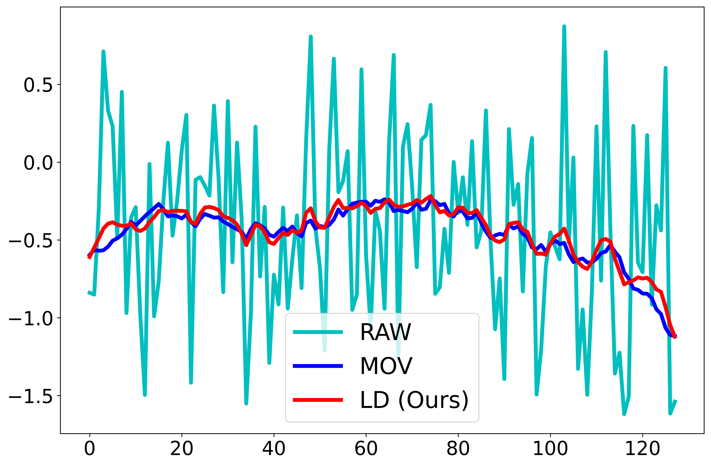 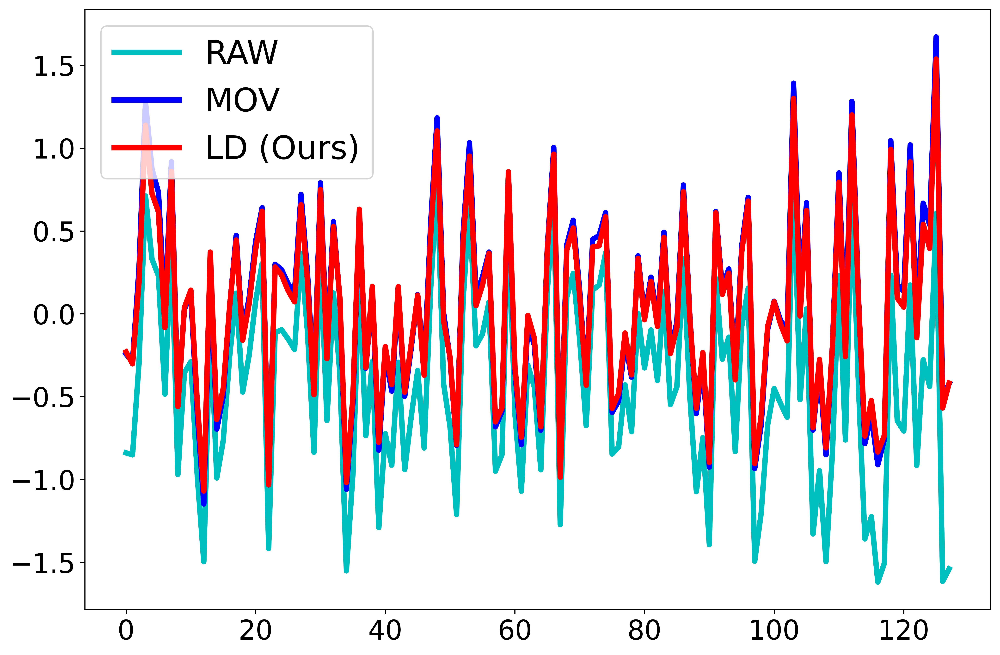

#### ETTm1 Trend-Seasonal Decomposition Results obttained by LD(Red) and MOV(Blue).  Left Trend part, Right seasonal Part.
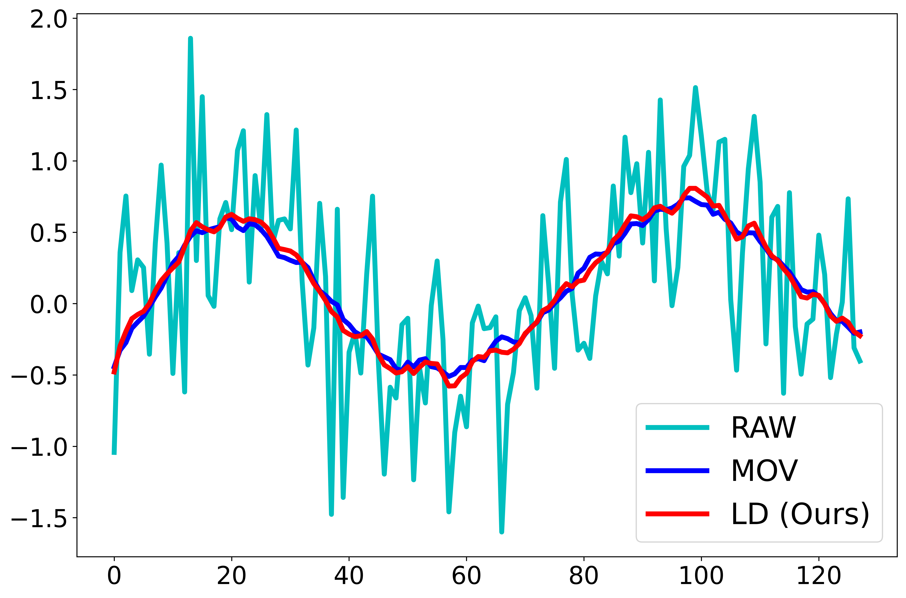 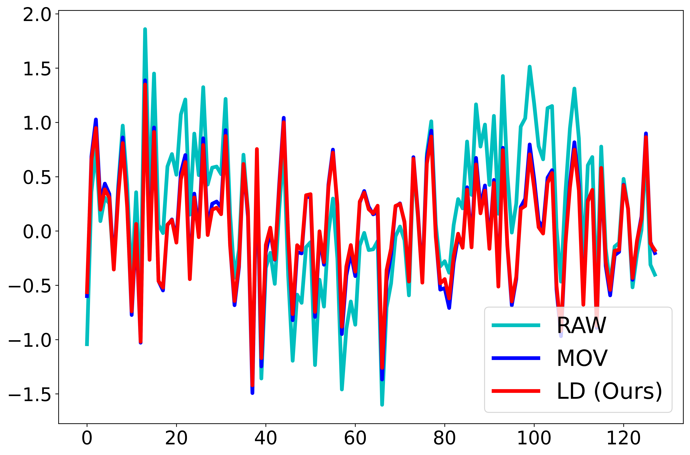

#### ETTm2 Trend-Seasonal Decomposition Results obttained by LD(Red) and MOV(Blue).  Left Trend part, Right seasonal Part.
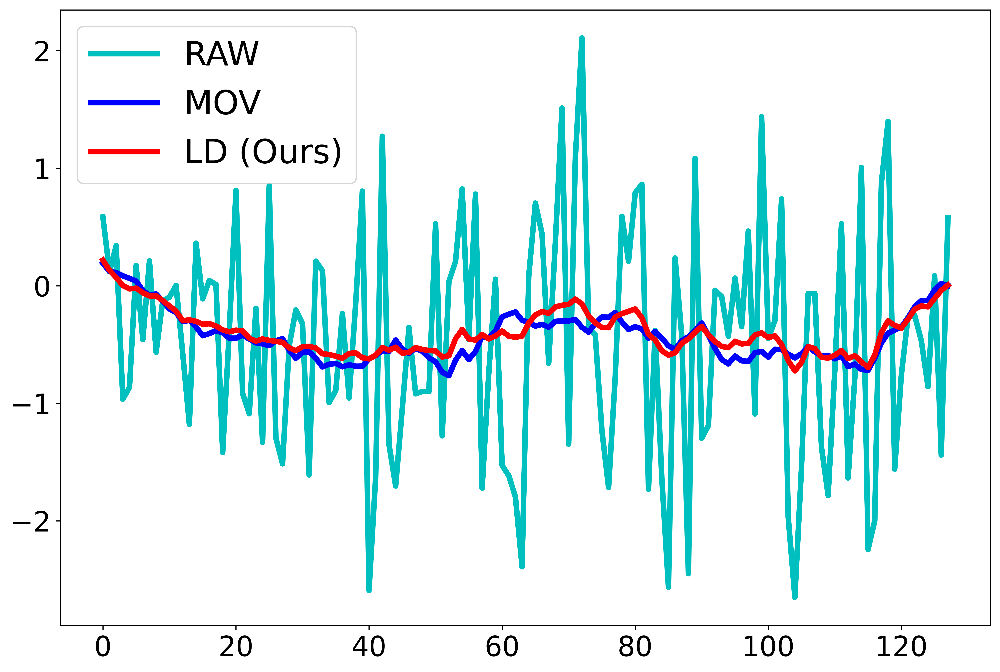 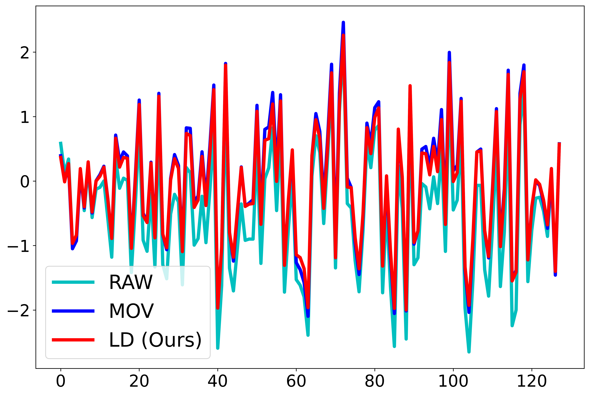

#### Electricity Trend-Seasonal Decomposition Results obttained by LD(Red) and MOV(Blue).  Left Trend part, Right seasonal Part.
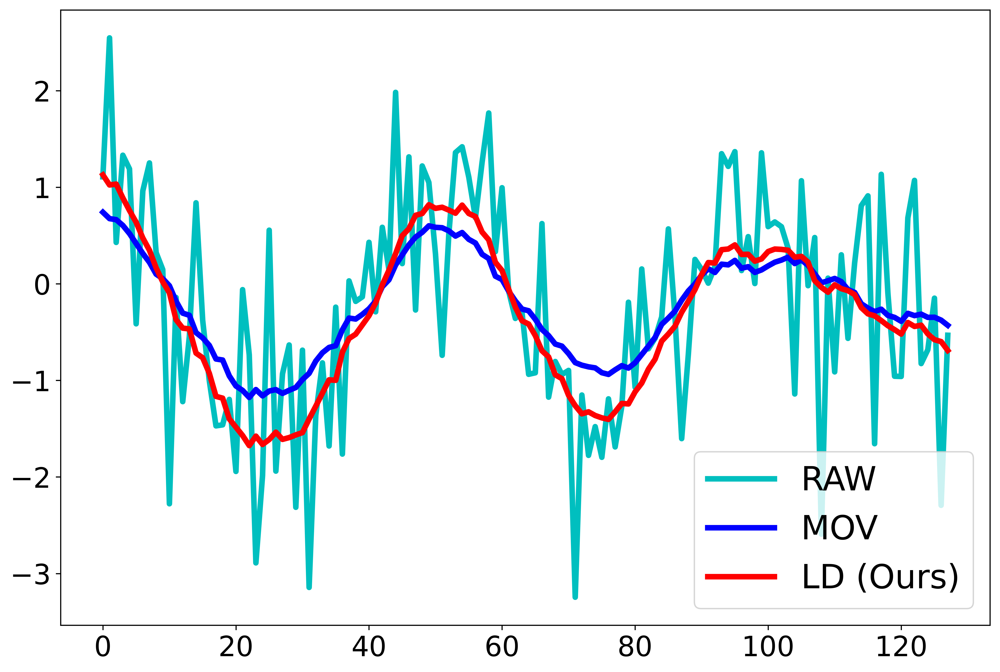 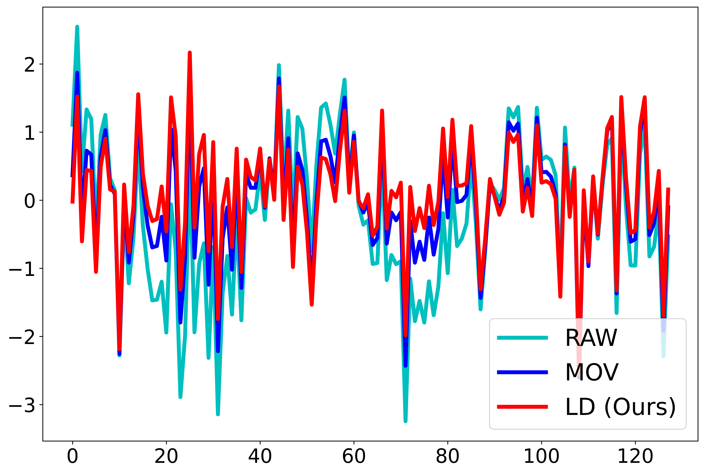

#### Traffic Trend-Seasonal Decomposition Results obttained by LD(Red) and MOV(Blue).  Left Trend part, Right seasonal Part.
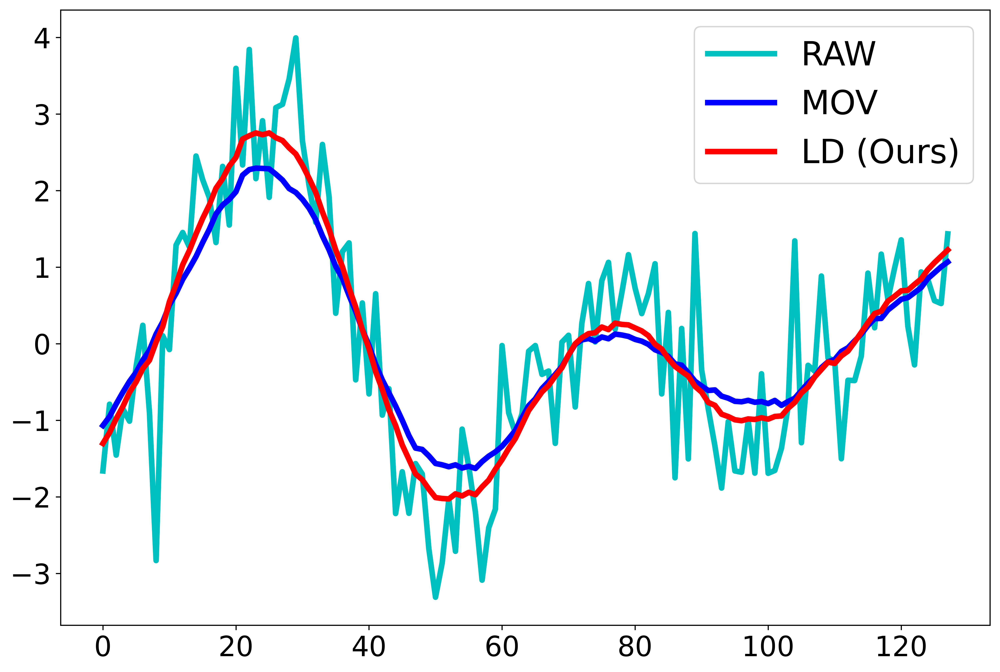 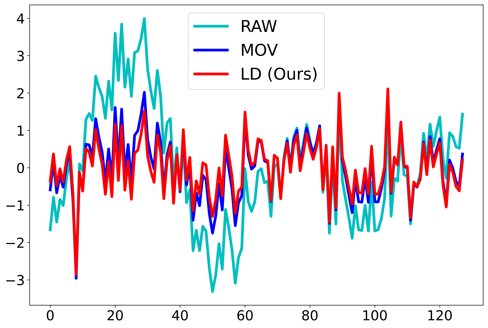

#### Solar Trend-Seasonal Decomposition Results obttained by LD(Red) and MOV(Blue).  Left Trend part, Right seasonal Part.
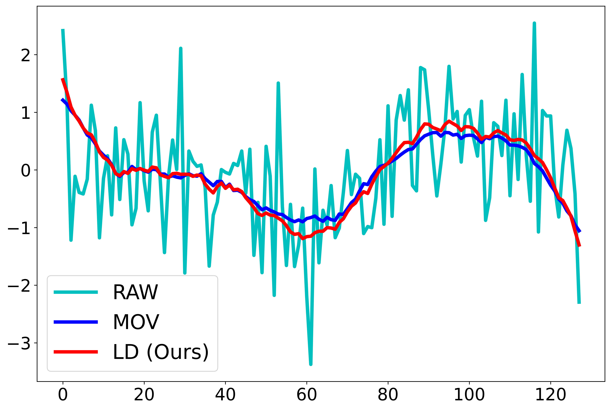 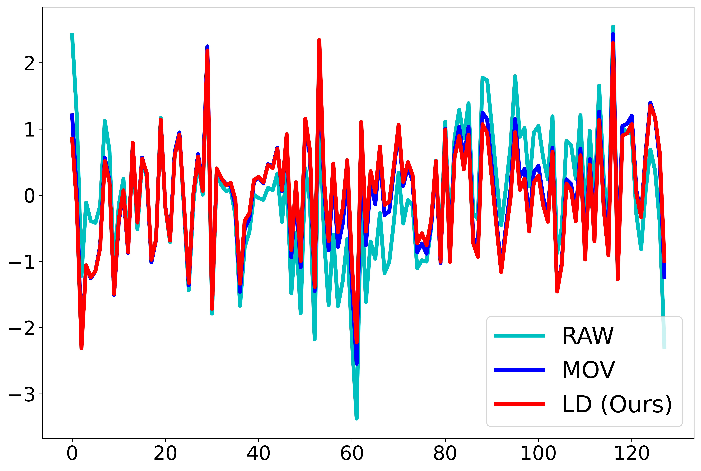

#### Weather Trend-Seasonal Decomposition Results obttained by LD(Red) and MOV(Blue).  Left Trend part, Right seasonal Part.
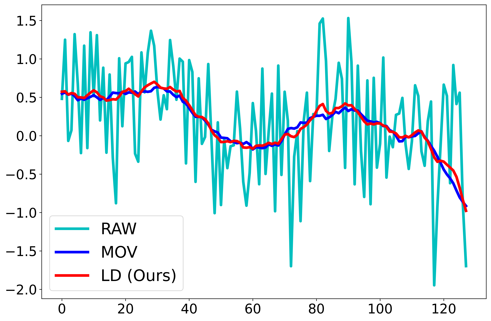 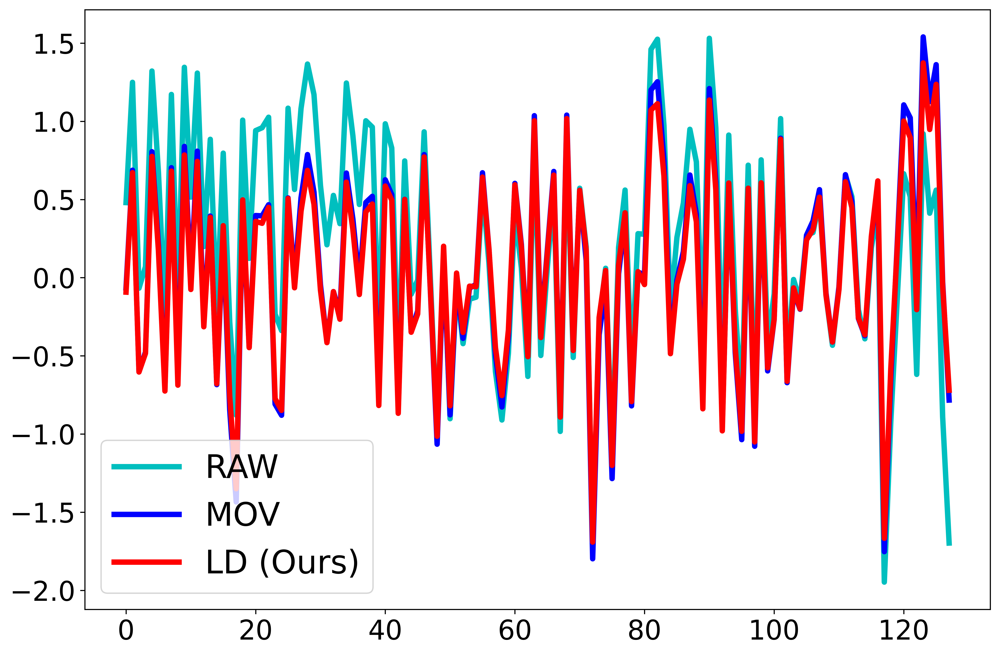
