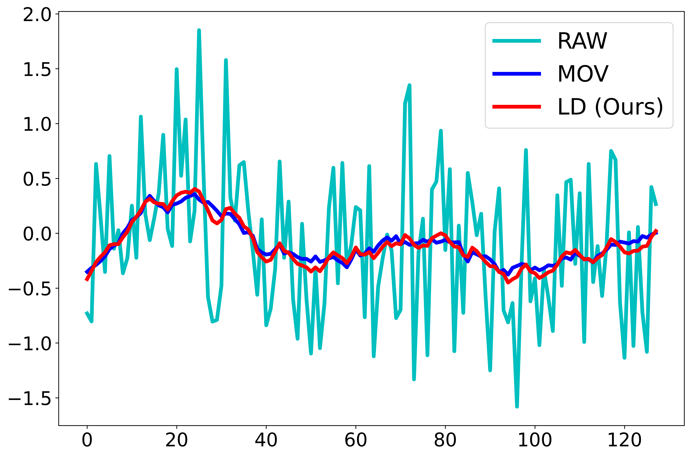
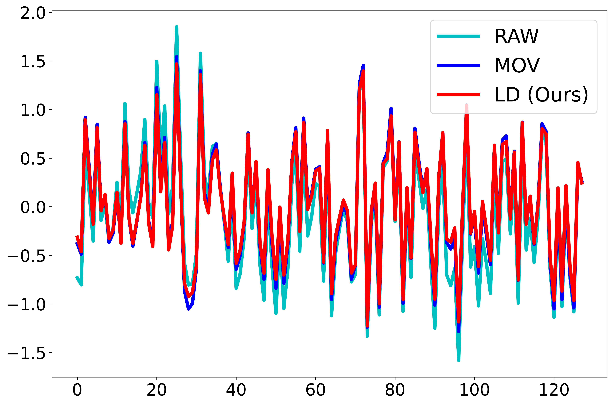

# Further Analysis of different decomposition strategy

To further investigate why our learnable decomposition kernel (LD) is a better time series decomposition solution than 
the simple moving average kernel ([MOV](https://arxiv.org/abs/2106.13008)), we conducted the following analysis on the seasonal part and trend part obtained from decomposition on eight datasets. 

Specifically, since the seasonal part represents repetitive patterns in the original sequence, 
a good seasonal part should capture all major frequencies in the original sequence.        
Hence, we separately calculated the similarity between the seasonal part obtained from
two decomposition strategies and the dominant frequencies of the top **66.6%** (i.e., the topk **2/3**) of the original sequence.

**A better decomposition strategy should yield a seasonal part with higher similarity to the dominant frequencies of the original sequence.**

Additionally, for a good trend part, it should effectively capture the trend changes in the original sequence. 
Thus, we utilized Dynamic Time Warping [DTW](https://doi.org/10.1007/978-3-540-74048-3_4) to compute the similarity between the original sequence and the trend parts obtained from the two decompositions. 

**A superior decomposition strategy should result in a trend part with higher DTW similarity to the original sequence.**

Below are the results:

| Kernel         | LD (Ours) |   LD (Ours)    | MOV     |    MOV     |
|----------------|-----------|-------|---------|-------|
| Dataset\Metric | DTW       | FFT   | DTW     | FFT   |
| Electricity    | **0.633**     | **0.978** | 0.614   | 0.913 |
| Solar_Energy   | **0.602**     | **0.960** | 0.590   | 0.920 |
| Traffic        | **0.650**     | **0.813** | 0.621   | 0.732 |
| weather        | **0.694**     | **0.987** | 0.686   | 0.956 |
| ETTh1          | **0.676**     | **0.995** | 0.670   | 0.983 |
| ETTh2          | **0.689**     | **0.996** | 0.683   | 0.834 |
| ETTm1          | **0.711**     | **0.909** | 0.704   | 0.846 |
| ETTm2          | **0.592**     | **0.921** | 0.573   | 0.907 |

It is very clear and a strong argument that **our LD** significantly outperforms **[MOV](https://arxiv.org/abs/2106.13008)** on eight datasets in terms of two metrics: **FFT** (similarity between the seasonal part and the most dominant frequency of the raw time series——**top 66.6%**) and **DTW** (DTW similarity between the trend part and the raw time series). Therefore, it is rational to conclude that **our LD is a superior time series decomposition approach compared to naive MOV**.

Given advice from reviewer xxx, in addition to the visualization results of the **trend part** obtained from the time series decomposition by **LD** and **[MOV](https://arxiv.org/abs/2106.13008)** as mentioned in the original paper, we further provide the visualization results of the **seasonal part** here.

## ETTh1 Trend part obttained by LD(Red) and MOV(Blue)

## ETTh1 Seasonal part obttained by LD(Red) and MOV(Blue)

